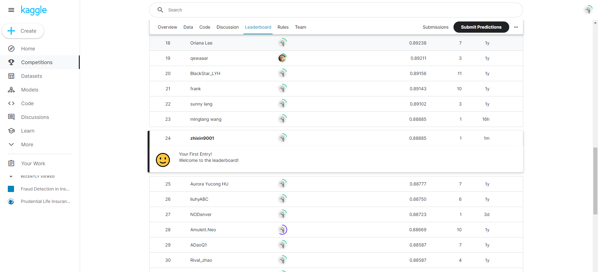

有了ChatGPT的帮助，就可以信心十足地涉略一些之前没经验地领域了。
这次的保险欺诈识别任务，数据来源于Kaggle的竞赛题目：https://www.kaggle.com/competitions/fraud-detection-in-insurance-claims
建模语言使用Python3，并使用Jupyter来组织给GPT的Promote和代码，完成后可以直接导出为markdown。
最终预测的成绩为0.88885, 最高分0.91244，已经很满意了😍

接下来是数据分析和建模的过程，为了缩短篇幅，GPT的回答部分只保留了代码。

问：你现在是一个数据建模人员，要对保险反欺诈进行预测。
数据包括：
1）训练集：train.csv （40个字段，有fraud_reported字段）
2）测试集：test.csv （39个字段，没有fraud_reported字
段）

PS: ChatGPT的第一次回答中包含了通用的建模步骤,这也是最核心的部分.
```python
作为数据建模人员，对保险反欺诈进行预测是一个有趣的任务。我可以帮助你制定一个基本的建模流程。下面是一个通用的步骤：

1. 导入必要的库和加载数据集：
   - 使用适合数据分析和建模的库，如Pandas、NumPy和Scikit-learn。
   - 使用Pandas库的`read_csv`函数加载训练集和测试集数据。

2. 数据探索和预处理：
   - 使用Pandas库的各种函数和方法来了解数据集的结构、特征和分布。
   - 检查缺失值和异常值，并根据需要进行处理。
   - 进行特征工程，包括特征选择、特征变换、创建新特征等。

3. 划分训练集和验证集：
   - 将训练集数据划分为用于训练模型的子集和用于验证模型性能的子集。
   - 这可以通过Scikit-learn库中的`train_test_split`函数实现。

4. 选择模型和训练：
   - 根据问题的特点选择适当的分类模型，如逻辑回归、决策树、随机森林等。
   - 使用训练集上的数据对所选模型进行训练。

5. 模型评估：
   - 使用验证集上的数据评估模型的性能。
   - 常见的评估指标包括准确率、精确率、召回率、F1分数等。

6. 模型优化和调参：
   - 根据模型性能对模型进行优化和调参，以改善预测效果。
   - 可以使用交叉验证、网格搜索等技术来找到最佳参数组合。

7. 对测试集进行预测：
   - 使用训练好的模型对测试集进行预测，并生成预测结果。

请注意，上述步骤是一个通用的流程示例，具体实现可能因数据集的特点和建模方法的选择而有所不同。另外，数据预处理、特征工程和模型选择等环节也可能需要根据具体情况进行进一步的调整和优化。
```

首先需要你对数据进行加载，分别得到 train和test。给我对应的Python代码


```python
import pandas as pd

# 加载训练集和测试集数据
train_data = pd.read_csv('train.csv')
test_data = pd.read_csv('test.csv')

# 查看训练集数据的前几行
print("训练集数据：")
print(train_data.head())

# 查看测试集数据的前几行
print("测试集数据：")
print(test_data.head())

# 检查数据集的维度
print("训练集数据维度：", train_data.shape)
print("测试集数据维度：", test_data.shape)
```

对train_data和test_data进行合并，生成data


```python
# 合并训练集和测试集
data = pd.concat([train_data, test_data], ignore_index=True)

# 查看合并后的数据框
print("合并后的数据：")
print(data.head())

# 检查合并后的数据框维度
print("合并后的数据维度：", data.shape)
```

对data进行数据探索，包括：缺失值，字段的唯一值个数


```python
# 检查每个字段的缺失值数量
missing_values = data.isnull().sum()
print("字段的缺失值数量：")
print(missing_values)

```


```python
# 计算每个字段的唯一值个数
unique_value_counts = data.nunique()
print("字段的唯一值个数：")
print(unique_value_counts)
```

在data中，去掉没有的字段 '_c39'


```python
# 去除字段 '_c39'
data = data.drop('_c39', axis=1)

# 检查更新后的数据框
print("更新后的数据：")
print(data.head())
```

筛选data中的字符串字段，赋值给cat_columns


```python
# 筛选出字符串字段
cat_columns = data.select_dtypes(include=['object'])

# 查看筛选出的字符串字段
print("字符串字段：")
print(cat_columns.head())

```

对data中的这些字符串字段，计算唯一值个数，并按照唯一值个数从大到小排序


```python
# 计算字符串字段的唯一值个数
unique_counts = data.select_dtypes(include=['object']).nunique()

# 按照唯一值个数从大到小排序
unique_counts_sorted = unique_counts.sort_values(ascending=False)

# 查看排序后的唯一值个数
print("按照唯一值个数排序后：")
print(unique_counts_sorted)
```

data中的property_damage字段有3种值，分别为：NO, YES 和 ?，分别将他们映射成0, 1, 2


```python
# 将三种值映射为 0, 1, 2
data['property_damage'] = data['property_damage'].replace({"NO": 0, "YES": 1, "?": 2})

# 查看更新后的数据框
print("更新后的数据：")
print(data['property_damage'].head())

```

对data中的police_report_available字段有3种值，分别为：NO, YES 和 ?，分别将他们映射成0, 1, 2


```python
# 将三种值映射为 0, 1, 2
data['police_report_available'] = data['police_report_available'].replace({"NO": 0, "YES": 1, "?": 2})

# 查看更新后的数据框
print("更新后的数据：")
print(data['police_report_available'].head())

```

data中有两个字段是日期类型，分别为policy_bind_date, incident_date，为确保他们是日期类型字段，需要将他们格式进行转换


```python
# 将字段转换为日期类型
data['policy_bind_date'] = pd.to_datetime(data['policy_bind_date'])
data['incident_date'] = pd.to_datetime(data['incident_date'])

# 查看更新后的数据类型
print("更新后的数据类型：")
print(data[['policy_bind_date', 'incident_date']])
```


```python
# 找到 policy_bind_date 的最小日期
min_policy_bind_date = data['policy_bind_date'].min()
# 计算每个记录的 policy_bind_date_diff
data['policy_bind_date_diff'] = (data['policy_bind_date'] - min_policy_bind_date).dt.days

# 查看更新后的数据
print("更新后的数据：")
print(data[['policy_bind_date', 'policy_bind_date_diff']].head())
```

同理，在data中创建一个新的字段incident_date_diff，它等于 (incident_date - policy_bind_date中日期最小值)的天数


```python

# 计算每个记录的 incident_date_diff
data['incident_date_diff'] = (data['incident_date'] - min_policy_bind_date).dt.days

# 查看更新后的数据
print("更新后的数据：")
print(data[['incident_date', 'incident_date_diff']].head())
```

在data中创建一个新的字段incident_date_policy_bind_date_diff，它等于incident_date_diff - policy_bind_date_diff


```python
# 创建新的字段 incident_date_policy_bind_date_diff
data['incident_date_policy_bind_date_diff'] = data['incident_date_diff'] - data['policy_bind_date_diff']

# 查看更新后的数据
print("更新后的数据：")
print(data[['incident_date_diff', 'policy_bind_date_diff', 'incident_date_policy_bind_date_diff']].head())

```

在data中去掉原始的日期字段 policy_bind_date和incident_date


```python
# 去掉原始的日期字段
data = data.drop(['policy_bind_date', 'incident_date'], axis=1)

# 查看更新后的数据框
print("更新后的数据：")
print(data.head())
```

在data中有字符串类型的字段，需要对他们进行标签编码


```python
from sklearn.preprocessing import LabelEncoder

# 重新筛选出字符串字段
data1=data;
cat_columns = data1.select_dtypes(include=['object'])

# 创建 LabelEncoder 对象
label_encoder = LabelEncoder()


# 遍历字符串字段，进行标签编码
for column in cat_columns:
    data1[column] = label_encoder.fit_transform(data1[column])

# 查看更新后的数据
print("更新后的数据：")
print(data1.head())

```

之前data是由train_data和test_data合并的，现在再将data拆分回train_data和test_data


```python
# 根据之前的索引或行数拆分回 train_data 和 test_data
train_data = data1[:len(train_data)]
test_data = data1[len(train_data):]

# 查看拆分后的数据
print("拆分后的 train_data：")
print(train_data.shape)

print("拆分后的 test_data：")
print(test_data.shape)

```

现在想要用LightGBM进行建模，对train_data进行训练，对test_data进行预测，其中 fraud_reported是目标字段，预测结果可以是概率值


```python
import lightgbm as lgb
from sklearn.metrics import roc_auc_score

# 定义特征和目标字段
features = train_data.drop('fraud_reported', axis=1)
target = train_data['fraud_reported']

# 创建 LightGBM 数据集
train_dataset = lgb.Dataset(features, label=target)

# 定义 LightGBM 参数
params = {
    'objective': 'binary',
    'metric': 'binary_logloss',
    'boosting_type': 'gbdt',
    'num_leaves': 31,
    'learning_rate': 0.05,
    'feature_fraction': 0.9,
    'bagging_fraction': 0.8,
    'bagging_freq': 5,
    'verbose': 0
}

# 在训练集上训练 LightGBM 模型
model = lgb.train(params, train_dataset, num_boost_round=100)

# 对测试集进行预测
test_features = test_data.drop('fraud_reported', axis=1)
test_pred = model.predict(test_features)

# 输出预测结果（概率值）
print("预测结果：")
print(test_pred)

```

读取sampleSubmission.csv，将fraud_reported字段设置为刚才得到的 test_pred，并保存为result_baseline.csv


```python
# 读取 sampleSubmission.csv 文件
submission = pd.read_csv("sampleSubmission.csv")

# 将 fraud_reported 字段设置为预测结果 test_pred
submission['fraud_reported'] = test_pred

# 保存结果为 result_baseline.csv 文件
submission.to_csv("result_baseline.csv", index=False)

# 打印保存成功的提示信息
print("结果已保存为 result_baseline.csv 文件")
```
